---

## Summary
What’s up folks! In this post, we’re going to set up a simple, small AD homelab for **CRTP** prep and polishing our Red Team skills. There are already a number of practical AD homelab guides and YouTube videos out there, but for some reason, I found most of them difficult to follow. That’s why I decided to create my own and document the process here (so I don’t forget it myself!) <br> <br>
Setting up an AD homelab is crucial if you are serious about Red Teaming. Homelabbing helps you understand both sides of the coin; you’ll understand why an attack works because you were the one who set up that misconfiguration in the first place. This changed my perspective on how I approach AD environments and truly helped me in my **CRTP journey**.<br>
<br>
I’m not a big fan of theory, so let’s get our hands dirty!"

## Network Diagram


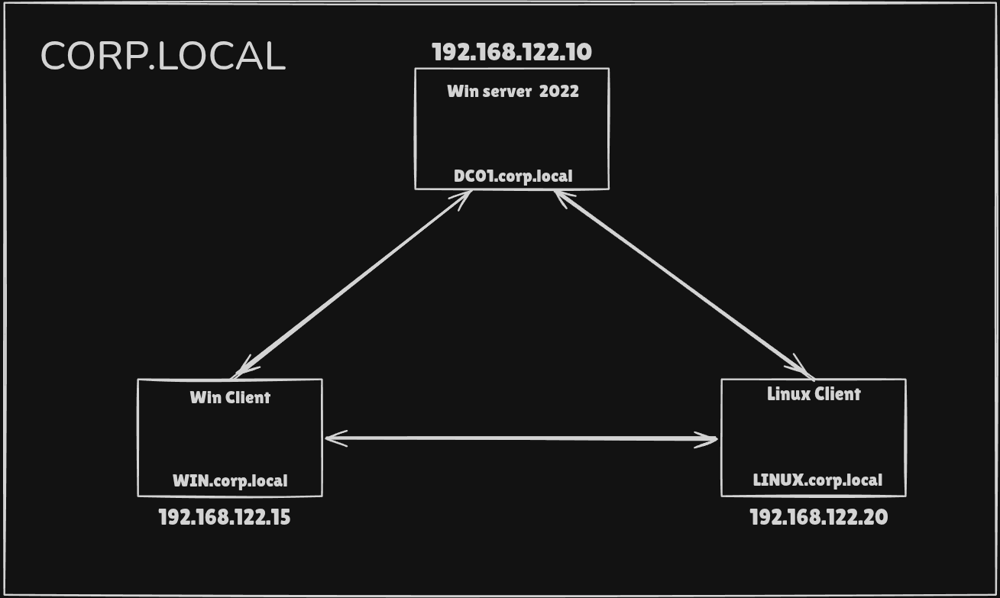
<p style="color: #ff2e2e; background: #1a1a1a; padding: 10px; border: 1px dashed #ff5555; font-family: monospace;">
    Keep in mind: The attacker machine sits outside the domain. We’re starting as an outsider with no "built-in" trust.
</p>

---

## Prerequisites
* I am using Windows Server 2022 Evaluation in this blog because Server 2025 is still very new and Server 2022 is much balanced and updated + Windows Server 2022 Evaluation comes with a 180-day trial period.
* We would have 2 client machines to setup and pactice misconfigurations : window 11 Enterprise and Ubuntu 25.10
* For AD homelabbing, Windows 11 Enterprise is significantly superior to Home, though Windows 11 Pro is usually the most practical choice for most users. Windows 11 Home lacks the ability to join a domain, making it unusable for Active Directory client simulation
<br>
<br>
Download Links :
1. Server 2022: https://www.microsoft.com/en-us/evalcenter/download-windows-server-2022
2. Windows 11 : https://www.microsoft.com/en-in/evalcenter/evaluate-windows-11-enterprise
3. Ubuntu     : https://ubuntu.com/download/desktop

---

## AD configuration and setup

### Server 2022 setup 

Download and Install [Windows Server 2022 Evaluation](https://www.microsoft.com/en-us/evalcenter/download-windows-server-2022) 
<br>
* Select Desktop Experience During installation

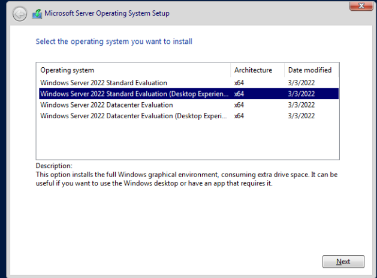
* Custom Installation
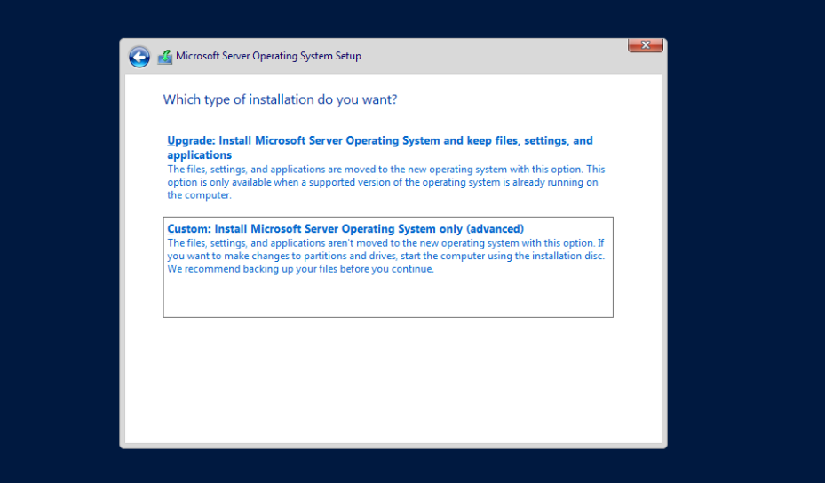

Select your Disk and Install. It might take a few minutes to completely install

After the installation completes, setup new Password and Login to the server

First thing we need to do after login is to Configure IP settings :

Internal IP of Server would be `192.168.122.10` According to our [Network Diagram](#summary)

Go to :
```
Control Panel → Network and Internet → Network and Sharing Center → Change 
adapter settings → Right click (Properties)
```
There Click properties of `ipv4` And Turn off `ipv6` (Optional)

Edit and add 
```
IP Address : 192.168.122.10
Subnet     : 255.255.255.0
Gateway    : 192.168.122.1
DNS        : 192.168.122.10
```
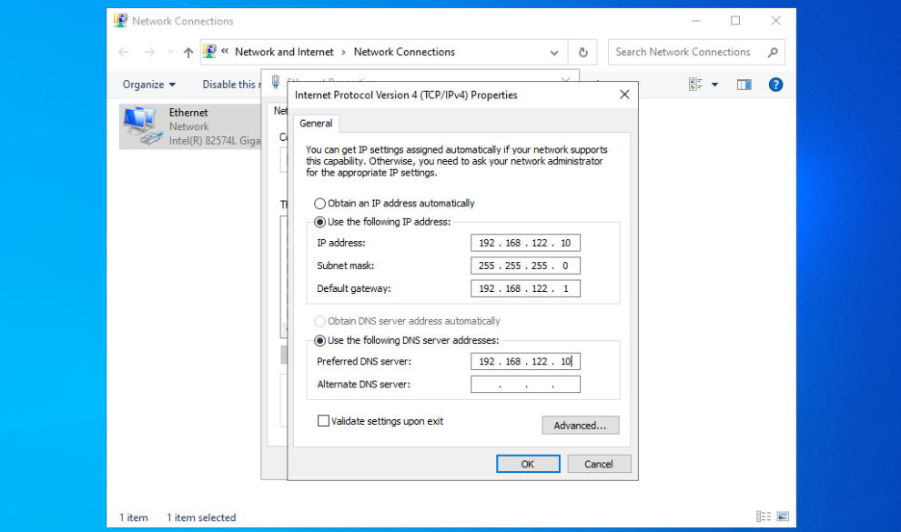

---

Next Rename our Computer 

```
Server Manager → Local Server → Computer Name → Change
```
Change it to `DC01` and this will prompt a `Restart`
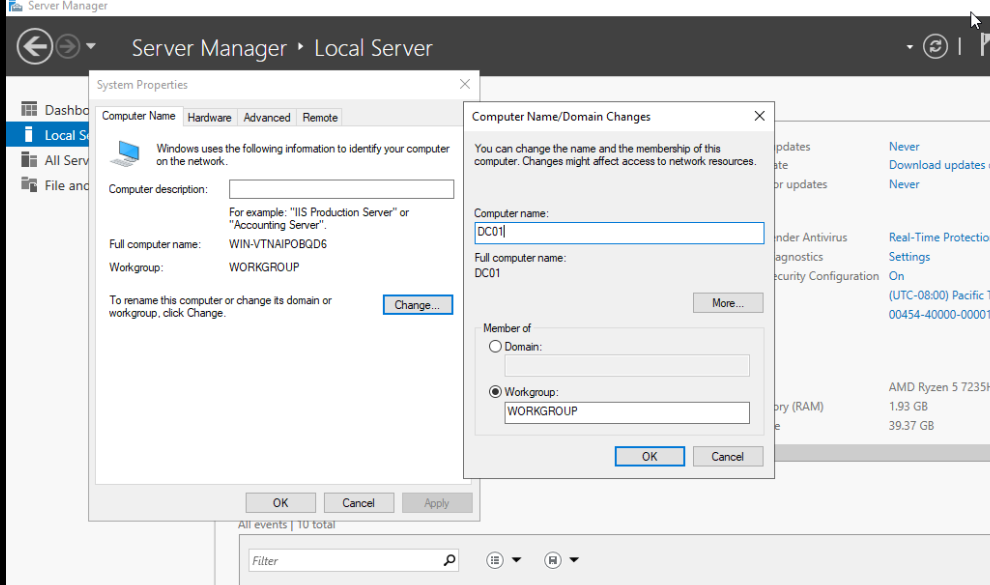

<br>

Now the most important Step :  Install Active Directory Domain Services

Go to 
```
server manager → Manage → Add Roles and Features
```
There select Active Directory Domain Services ( Second Option) and Install


After Sucessfull installation, Click `Promote Server to Domain Controller` Option in Manage. It will promote our computer to DC (Domain Controller)

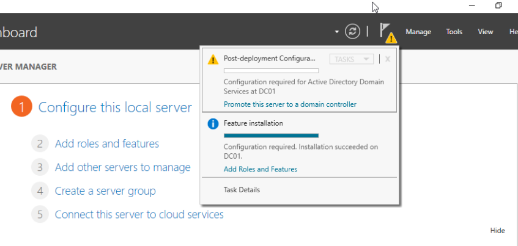

Select `Add a New Forest` and Name the domain `corp.local` (You can name anything you like)

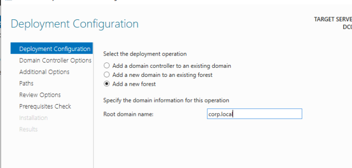

Create a new DSRM password and click Install

>The DSRM password serves as a local administrator credential required to access and repair a Domain Controller when Active Directory services are offline or inaccessible. It provides a critical "backdoor" for system recovery and database restoration during emergency maintenance scenarios

Leave everything else by Default and click next

Install and it will force `Restart`

If you have done everything correctly, you will see the screen below:
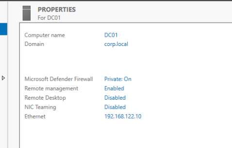

Done! 
* We have finished the `Windows Server` installation, 
* Promoted the server to a `Domain Controller`, and 
* Established the `corp.local` forest

<p style="color: #99c5a3; background: #1a1a1a; padding: 10px; border: 1px dashed #a34545; font-family: monospace;">
    We Still need to tweak Firewall and Some settings in order to start "Attacking" the DC, Those will be covered in the Second Part of the Blog
</p>

---

### Windows Client Domain Join

So that we created a new forest `corp.local` and new DC, Let's add some client machines to the domain.

We are installing and joining our [Windows 11](https://www.microsoft.com/en-in/evalcenter/evaluate-windows-11-enterprise)  to DC and form our attack chain

After selecting the disk and everything the Windows will start installing
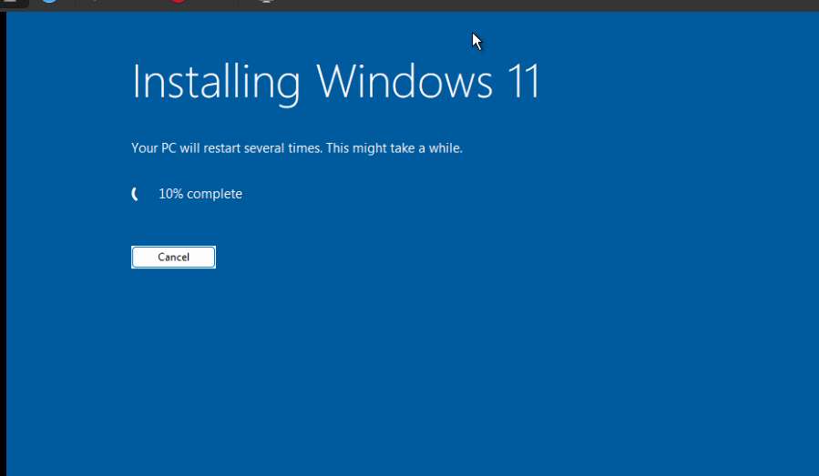

During the final setup click `Sign-in Options` to Join Domain
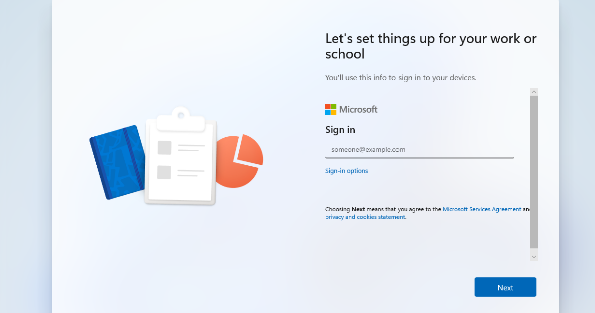

then Select `Domain Join Instead` and Create a local account
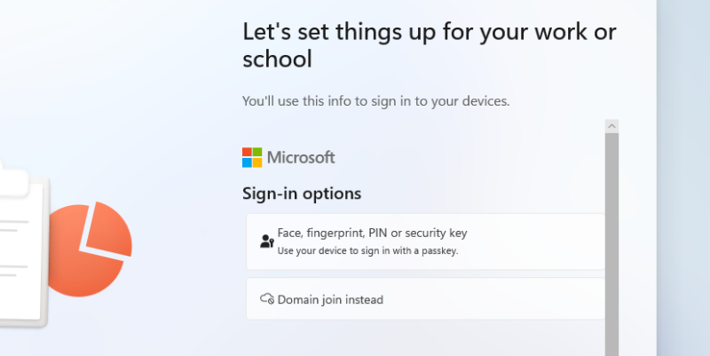

Wait for the installation to finish and login to Windows 11

Same as in Server here also we need to Configure IP settings first
```
Control Panel → Network and Internet → Network and Sharing Center → Change 
adapter settings → Right click (Properties)
```

Change it to 
```
IP Address : 192.168.122.15
Subnet     : 255.255.255.0
Gateway    : 192.168.122.1
DNS        : 192.168.122.10
```

> In Active Directory, computers don’t directly know where the Domain Controller is. Instead, they uses DNS to discover Domain Controllers and services, so clients must use the DC as their DNS server.

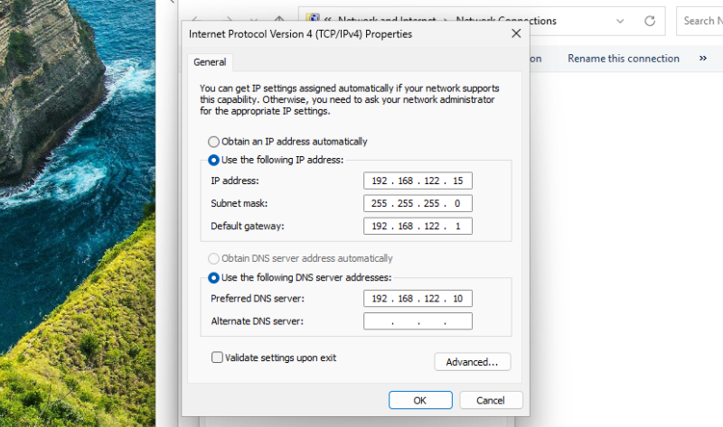

Next Rename the PC inside `Settings → System → About → Rename this PC`

Renamed into `Win-Client` and `Restart`
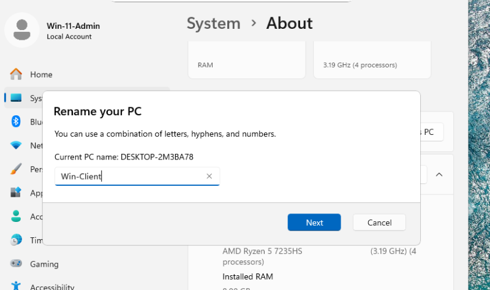

Now We Join the windows client to Domain

Navigate to 
```
Settings → System → About → Domain or Workgroup → Computer Name → Change
```

Here select Member of `Domain` and type domain name `corp.local` save and it will ask for Administrator password of DC 

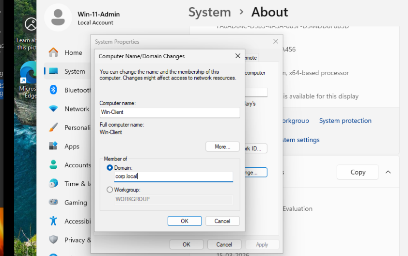

If you succeed you will get similar message as below
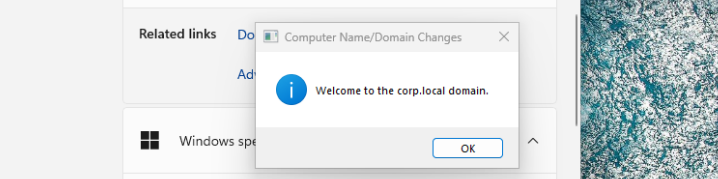

The system will restart and Done !<br>
We have joined Windows client machine to Domain !!

---

### Linux Client Domain Join

Now let's install [Ubuntu](https://ubuntu.com/download/desktop) and Join Domain

Configure Ubuntu and start Installation

Once the installation completes Add DNS server in Network settings. <br><br>
`Open Wifi settings -> Select Network -> Network Option -> IPV4 Settings`

```
IPv4 Method → Automatic (DHCP)
DNS → 192.168.122.10
```
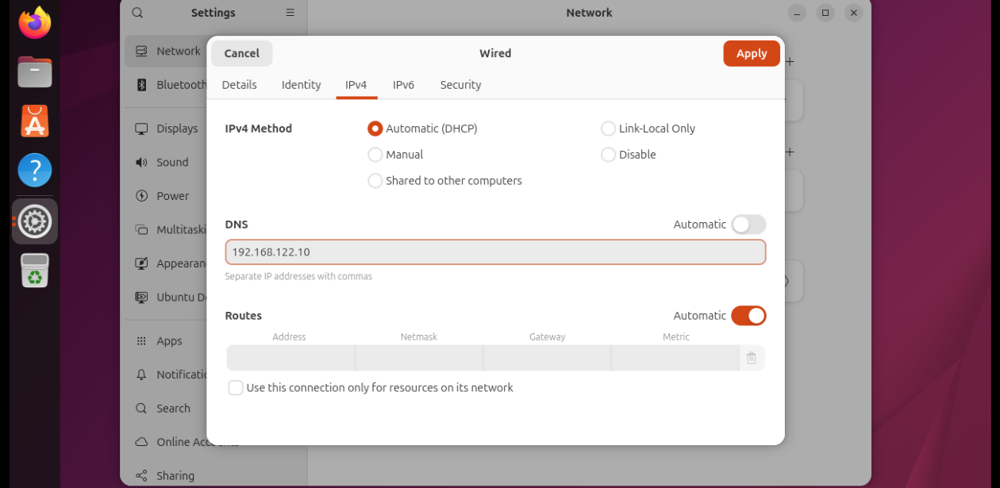

Next Change Computer name
```
sudo hostnamectl set-hostname ubuntu-client.corp.local
```

Now an important step. Let's edit `resolv.conf` file

Add this to the bottom of `/etc/resolv.conf`
```
nameserver 192.168.122.10
search corp.local
```
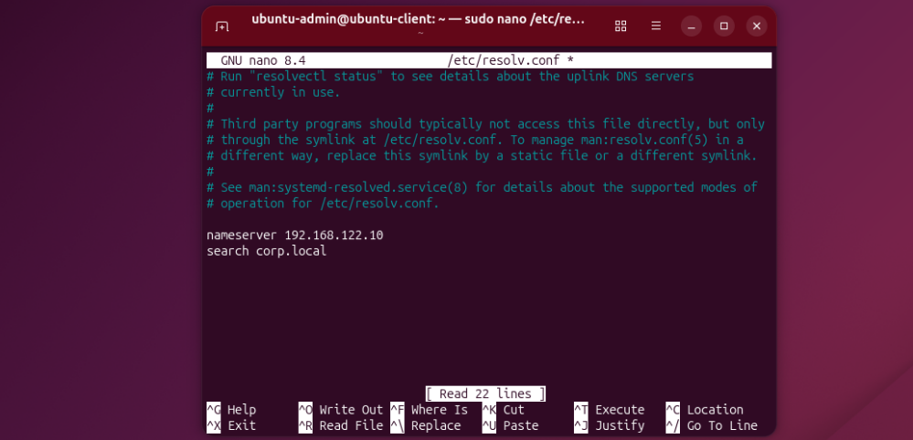

Check if the Client can communicate with `DC`

```
nslookup corp.local
```
Everything good if the output shows similar to below
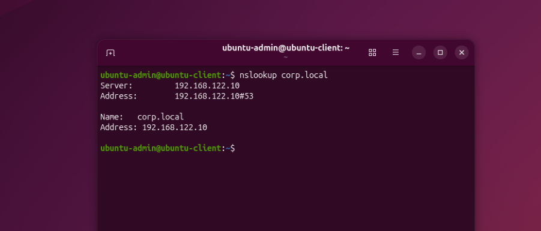
<br>

Now We Join the Ubuntu client to Domain

```
realm discover corp.local
```
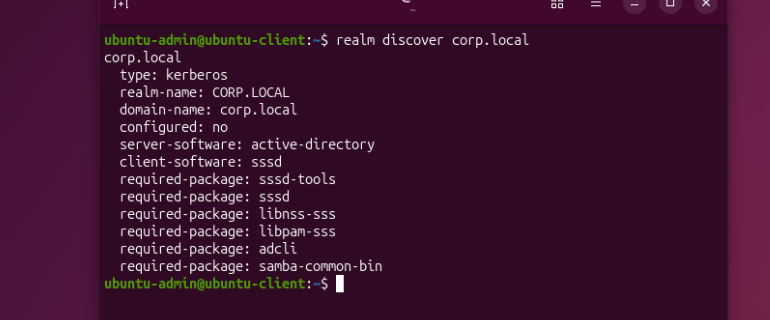

```
sudo realm join corp.local -U Administrator
```

This will prompt for DC admin password
<br>
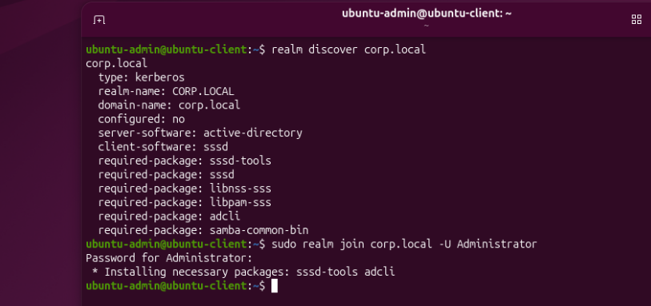

<br>
Done !!! we have now joined 2 client machines into Domain
<br><br>

Alternatively we can check in DC if both are joined sucessfully

Open `Active Directory Users and Computers` Select `Computers`

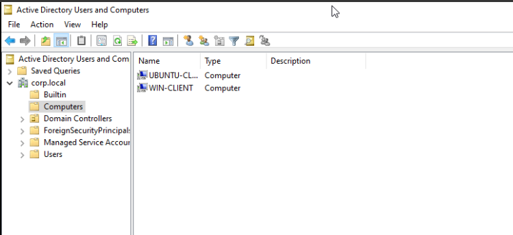

Here we can see both the computers are present

---

## Conclusion

And that’s a wrap for Part 1!

At this stage we have successfully:

* Installed Windows Server 2022
* Promoted it to a Domain Controller
* Created our corp.local forest
* Joined two client machines to the domain
    * Windows 11 Client
    * Ubuntu Client

We now have a Domain Controller and two client machines successfully joined to the `corp.local` domain, forming the foundation of our Red Team practice environment.

In `Part 2`, we’ll start making the lab more realistic by adding users, groups, and intentional misconfigurations, and begin exploring Active Directory enumeration and attack paths.

Stay tuned. 🚀

---
If you found this guide helpful or want to follow along with more Active Directory, Red Teaming, and homelab research, feel free to connect with me.

